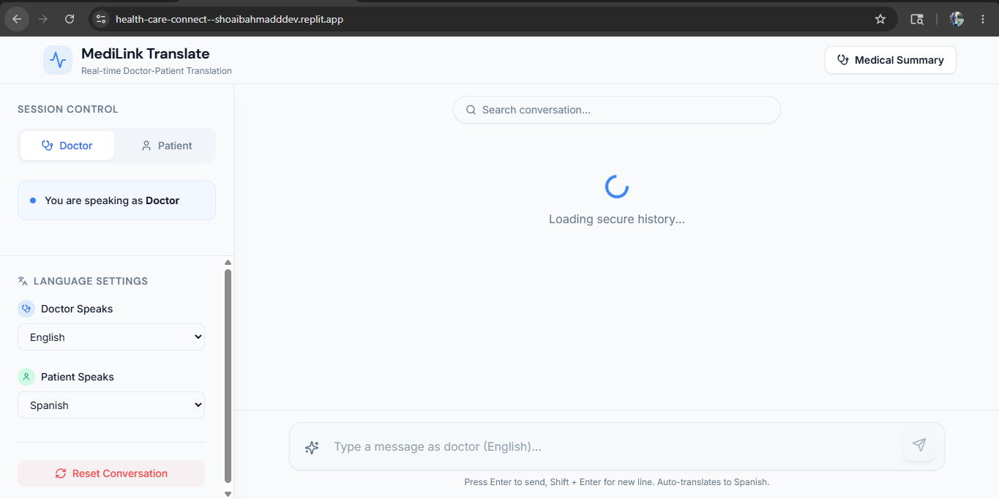

<div align="center">

# 🩺 AI-Powered Healthcare Doctor–Patient Translation Platform

### Real-Time Multilingual Healthcare Communication System Powered by AI

<p align="center">
  
  
  
  
</p>

<p align="center">
  
  
  
  
</p>

<p align="center">
  <a href="YOUR_LIVE_LINK_HERE">
    
  </a>
  <a href="https://github.com/shoaib-ahmadd">
    
  </a>
</p>

</div>

---

#  Overview

This project is a full-stack AI-powered healthcare communication platform designed to improve conversations between doctors and patients speaking different languages.

The platform enables:
- 🌍 Real-time multilingual communication
- 🤖 AI-generated medical summaries
- 💬 Persistent healthcare conversations
- 🔎 Searchable message history
- ⚡ AI-assisted healthcare workflows

The primary objective of the application is to reduce communication barriers in healthcare environments using scalable AI-powered systems.

---

#  Core Features

## 🌐 Real-Time Translation

- Instant multilingual message translation
- OpenAI-powered AI translation workflows
- Dual message rendering:
  - Original message
  - AI-translated message

---

## 🤖 AI Medical Summarization

The system automatically generates structured AI summaries including:

- Symptoms discussed
- Possible diagnoses
- Medications mentioned
- Suggested follow-up actions

AI responses are processed server-side before being returned to the client.

---

## 💬 Persistent Conversation Storage

- PostgreSQL-powered message persistence
- Historical conversation retrieval
- Keyword-based search functionality
- Structured chat storage architecture

---

## 👨‍⚕️ Role-Based Interaction

Supports:
- Doctor interaction mode
- Patient interaction mode

Designed to simulate real healthcare communication workflows.

---

## 📱 Responsive Full-Stack UI

- Fully responsive healthcare interface
- Mobile and desktop optimized
- Built using modern frontend technologies
- Smooth and scalable user experience

---

# 🛠️ Tech Stack

<div align="center">

## Frontend


## Backend


## Database


## AI & Development Tools


</div>

---

# 🏗️ System Architecture

The project follows a modular full-stack architecture with proper separation between frontend, backend, AI services, and database layers.

## Frontend Layer
Responsible for:
- User interaction
- Rendering translated outputs
- Managing responsive UI workflows

## Backend Layer
Responsible for:
- REST API routing
- OpenAI API integration
- AI response handling
- Database operations

## Database Layer
PostgreSQL is used for:
- Conversation persistence
- Search functionality
- Structured message storage

## AI Processing Layer
AI workflows include:
- Real-time translation
- Medical summarization
- Structured response generation

---

# ⚙️ Engineering Decisions

- Modular full-stack architecture
- Clear separation of concerns
- Server-side AI processing
- Scalable REST API structure
- Async API communication handling
- Readable and maintainable codebase
- Optimized UI workflows for healthcare use cases

---

# 📂 Project Structure

```bash
healthcare-doctor-patient-translation/
│
├── client/
├── screenshots/
│   └── home.png
│
├── attached_assets/
├── replit_integrations/
│
├── package.json
├── vite.config.ts
├── tailwind.config.ts
├── drizzle.config.ts
├── tsconfig.json
└── README.md
```

---

# 📸 Application Preview

<div align="center">

## 🏠 Home Interface



</div>

---

# 🔒 Current Limitations

- Authentication is not implemented
- Single active conversation workflow
- Demonstration-focused implementation
- Not production-level healthcare compliant

---

# 🚀 Future Improvements

- Secure authentication & authorization
- Multi-session support
- Voice-to-text integration
- Text-to-speech support
- Advanced medical entity extraction
- AI evaluation pipelines
- Production-grade security hardening

---

# 🌐 Live Demo

<div align="center">

### 🚀 Live Application

🔗 https://health-care-connect--shoaibahmadddev.replit.app/

</div>

---

# ⚡ Local Setup

## 1️⃣ Clone Repository

```bash
git clone https://github.com/shoaib-ahmadd/healthcare-doctor-patient-translation.git
```

---

## 2️⃣ Navigate Into Project

```bash
cd healthcare-doctor-patient-translation
```

---

## 3️⃣ Install Dependencies

```bash
npm install
```

---

## 4️⃣ Configure Environment Variables

Create a `.env` file and add:

```env
OPENAI_API_KEY=your_api_key
DATABASE_URL=your_database_url
```

---

## 5️⃣ Run Development Server

```bash
npm run dev
```

---

# 📈 Project Goals

This project was built to explore:
- AI-assisted healthcare workflows
- Real-time multilingual communication systems
- Practical OpenAI integrations
- Scalable full-stack architecture
- Human-centered AI product development

---

# 🤝 Contributing

Contributions, improvements, and suggestions are welcome.

Feel free to fork the repository and submit pull requests.

---

# 📄 License

This project is intended for educational and demonstration purposes.

---

<div align="center">

### Built with ❤️ by Shoaib Ahmad

<p align="center">
  <a href="https://github.com/shoaib-ahmadd">
    
  </a>
</p>

</div>
